## App Demo

<!--

 -->

 
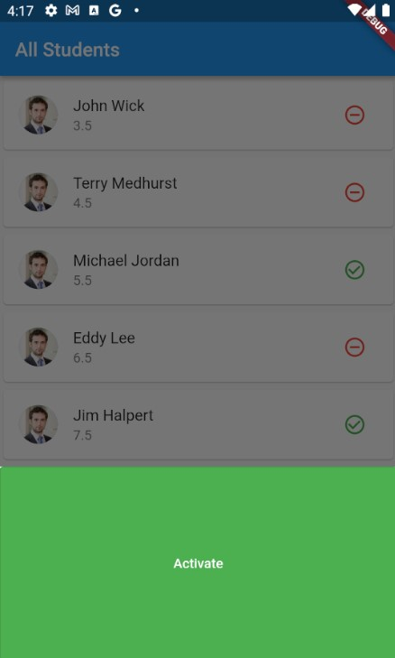 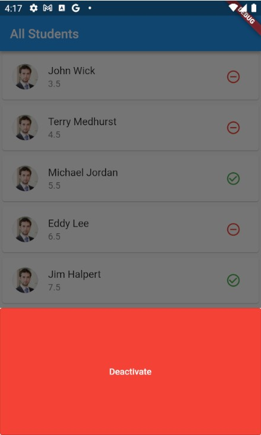

## Widget Inspector

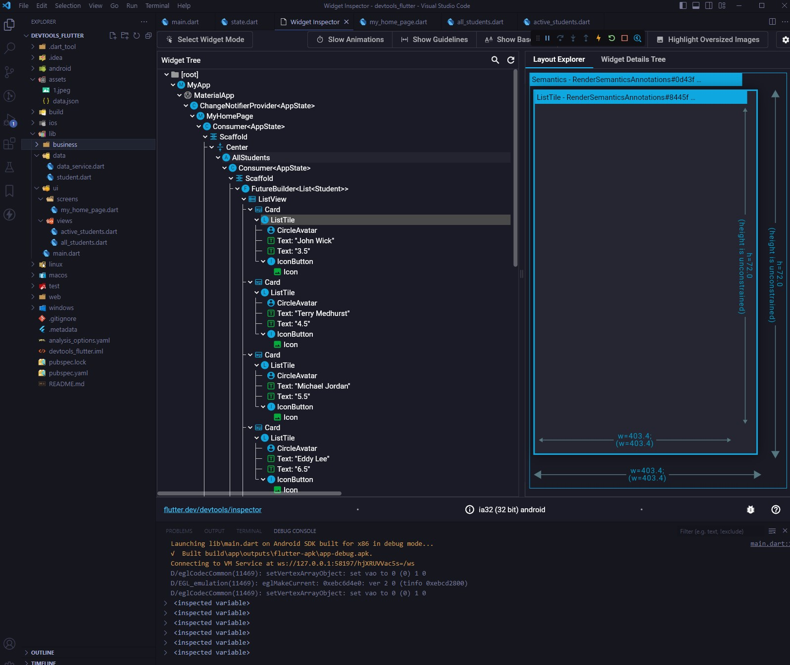

## Performance view with 1 Jank

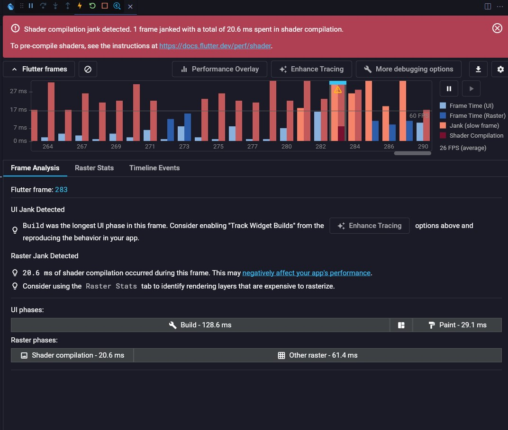

## Optimized by changing User pic from 1000x100 to 500x500 – Jank is gone

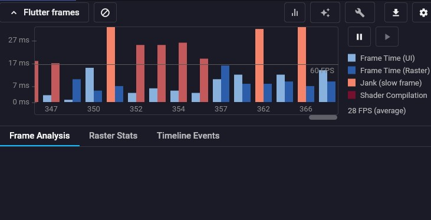

## Cpu Profiler

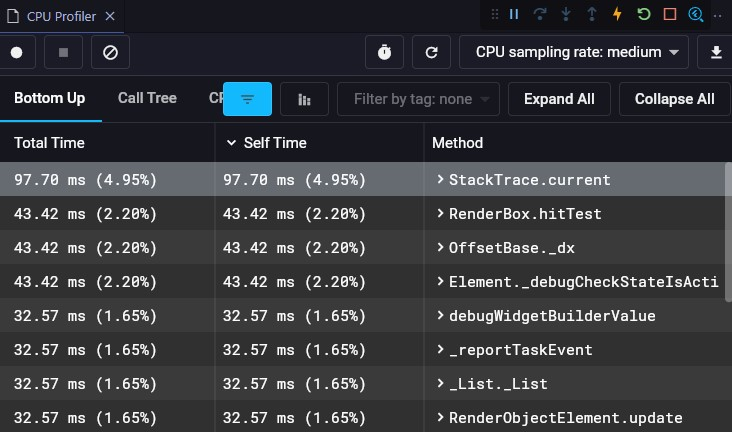

## Memory View

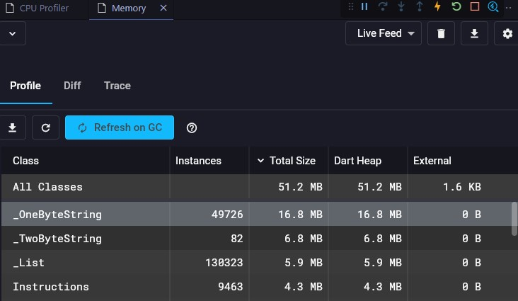

## Added memory leak by re-building widget every second – Total Size, Heap size, No. of List instances went up

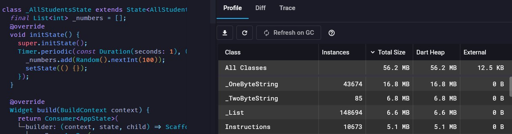

## Network tab - Added http request

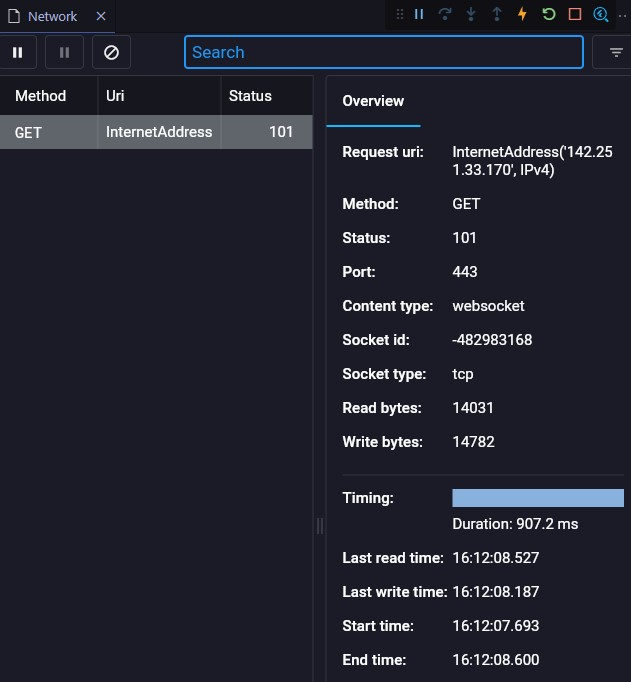

## App size with http request

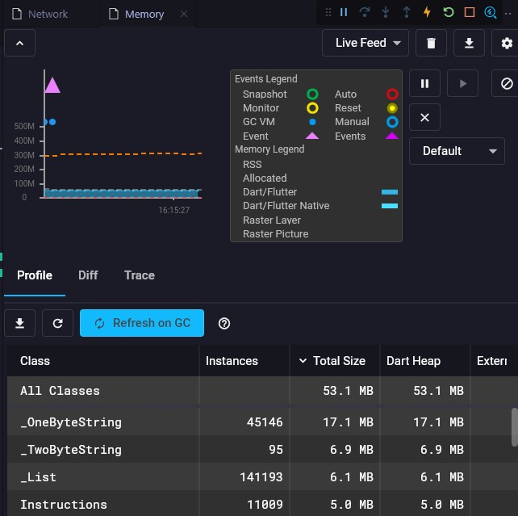

## App size without http request

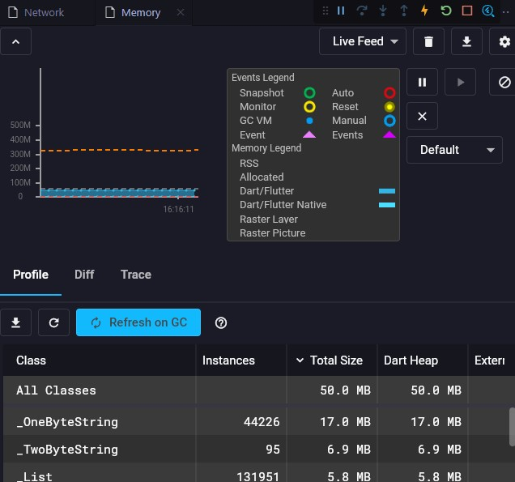
